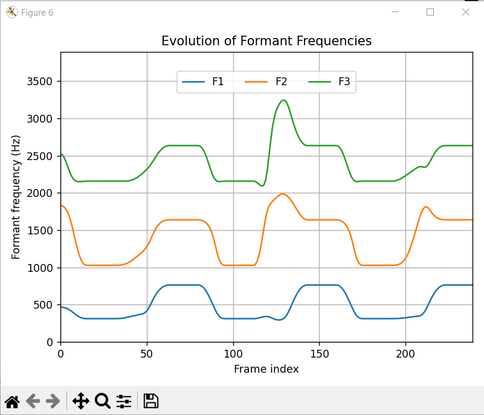

# Software for Syllable Synthesis and Supplementary Materials

[](https://doi.org/10.5281/zenodo.15527268)

This project accompanies the article:

**"Articulatory modeling of the S-shaped F2 trajectories observed in Öhman's spectrographic analysis of VCV syllables"**

## Overview

This repository contains Python scripts and supplementary data for the synthesis and visualization of VCV syllables and other syllabic structures using articulatory modeling.

## Files and Contents

- `synthSYL.py` – Main script for syllable synthesis.  
- `addAtoV.py` – Utility for dubbing audio onto video. Takes `essai.wav` and `output.avi` as input and generates the synchronized video `audio_video.avi`.  
- `convert2mp4.py` – Converts AVI video to MP4 format.  
- `Hull3DOhman.py` – Generates Figure 3 of the article. Requires `LocusOhman.npy`, which is produced by `synthSYL.py` (along with `essai.npy`).  
- `locusF2F3.py` – Generates Figure 4 of the article.  
- `output.avi`, `audio_video.avi` – Example videos.  
- `LICENCE` – MIT License file.  
- `requirements.txt` – List of required Python packages.  
- `CITATION.cff` – Citation metadata for this software.

## Installation

### Requirements

- Python 3.8 or later

### Recommended Setup

```bash
python -m venv venv
source venv/bin/activate  # On Windows: venv\Scripts\activate
pip install -r requirements.txt
```

## Usage

Run the main script:

```bash
python synthSYL.py
```

Other available scripts:

```bash
python addAtoV.py
python convert2mp4.py
python Hull3DOhman.py
python locusF2F3.py
```

## Functionality Overview

This software:

- Plans various syllable structures  
- Concatenates syllables  
- Generates articulatory parameters and formant frequencies  
- Synthesizes audio from articulatory parameters  
- Merges the synthesized audio with a video of the animated Maeda model  
- Plots figures for visual inspection

## Screenshots

The `docs/` folder contains screenshots illustrating the use of `synthSYL.py`.

### A) Isolated Syllable Synthesis

1. Prompt example:  
     
2. Planning of the final syllable:  
     
3. Articulatory parameters of all syllables:  
     
4. First three formants:  
     
5. Spectrogram:  
     

### B) Syllable Concatenation Using `.`

1. Prompt example:  
     
2. Articulatory parameters for the full word:  
     
3. Resulting formants:  
     
4. Spectrogram:  
   

## License

This project is licensed under the MIT License. See the [LICENSE](./LICENSE) file for details.

## Citation

If you use this software or data in your work, please cite it as follows:

> Frédéric Berthommier. *Software for Syllable Synthesis and Supplementary Materials for "Articulatory modeling of the S-shaped F2 trajectories observed in Öhman's spectrographic analysis of VCV syllables."* Zenodo, 2025. [https://doi.org/10.5281/zenodo.XXXXXXX](https://doi.org/10.5281/zenodo.XXXXXXX)

You can also use the citation metadata in the `CITATION.cff` file.

---

Feel free to open an issue or contact the author for questions or contributions.
